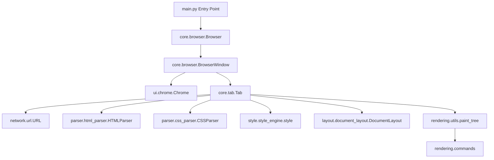

# Project Documentation: Python Tkinter Web Browser

Welcome to the comprehensive technical documentation for the **Web Browser** project—a toy web browser implementation written in Python using only standard library modules (e.g., `tkinter`, `socket`, `ssl`) and custom rendering, layout, styling, and parsing pipelines.

This document is organized into structured sections reflecting the discovery, architecture, layout engine, data flow, security review, and onboarding guidelines of the project.

---

## Phase 1 — Repository Discovery

### Repository Structure

```text
webbrowser/
├── .gitignore
├── browser.css
├── main.py
├── PROJECT_STRUCTURE.md
├── README.md
├── requirements.txt
├── config/
│   ├── __init__.py
│   ├── constants.py
│   └── paths.py
├── core/
│   ├── __init__.py
│   ├── bookmarks.py
│   ├── browser.py
│   └── tab.py
├── dom/
│   ├── __init__.py
│   ├── nodes.py
│   └── utils.py
├── layout/
│   ├── __init__.py
│   ├── block_layout.py
│   ├── document_layout.py
│   ├── geometry.py
│   └── inline_layout.py
├── network/
│   ├── __init__.py
│   ├── cache.py
│   └── url.py
├── parser/
│   ├── __init__.py
│   ├── css_parser.py
│   ├── html_parser.py
│   └── lexer.py
├── rendering/
│   ├── __init__.py
│   ├── commands.py
│   └── utils.py
├── style/
│   ├── __init__.py
│   ├── selectors.py
│   └── style_engine.py
└── ui/
    ├── __init__.py
    ├── chrome.py
    └── fonts.py
```

### Discovery Details

*   **Entry Point**: [main.py](file:///e:/webbrowser/main.py)
*   **Default CSS Stylesheet**: [browser.css](file:///e:/webbrowser/browser.css)
*   **Dependency Files**: [requirements.txt](file:///e:/webbrowser/requirements.txt) (lists no external package dependencies)
*   **Configuration Files**: [config/constants.py](file:///e:/webbrowser/config/constants.py) and [config/paths.py](file:///e:/webbrowser/config/paths.py)
*   **User Data Location**: Managed dynamically by `paths.py` inside the user profile under `APPDATA\WebBrowser` (Windows) or `~/.webbrowser` (Linux/macOS).
*   **Bookmarks File**: `bookmarks.txt` inside the User Data Location, managed by [core/bookmarks.py](file:///e:/webbrowser/core/bookmarks.py).

---

## Phase 2 — Architecture Reconstruction

The project is structured like a real modern browser, albeit simplified:



### High-Level Components

1.  **Network Stack (`network/`)**: Parses strings into `URL` structures. Resolves relative addresses, maintains standard connections over HTTP/HTTPS sockets with support for redirects, and caches content.
2.  **HTML/CSS Parsers (`parser/`)**: A Lexer tokenizes the source code into Text/Tag tokens. An HTML parser constructs a DOM tree, and a CSS parser handles style declarations, classes, tag matching, and descendant rules.
3.  **Style Engine (`style/`)**: Computes styling properties for DOM nodes, cascading priorities of rules, handling `!important` flags, expanding inline styles, and resolving font sizes.
4.  **Layout Engine (`layout/`)**: Translates structured DOM nodes into a Layout Tree. Recursively computes element geometry (x, y, width, height) supporting block-level, line-level, and inline text layout wrapping.
5.  **Rendering Pipeline (`rendering/`)**: Formulates raw Tkinter commands (`DrawText`, `DrawRect`, `DrawLine`, `DrawOutline`) in a display list. Clips drawings based on window geometry and scroll offsets.
6.  **Browser Shell & UI (`core/`, `ui/`)**: Manages the application runtime, coordinates windows and tabs, handles system keyboard/mouse events, maps clipboard copy/paste, and draws the custom browser chrome (tabs, back/forward buttons, bookmarks, address bar).

---

## Phase 3 — Directory Documentation

### [config](file:///e:/webbrowser/config)
*   **Purpose**: Manages system constants, configuration variables, and directories for local persistence.
*   **Responsibilities**: Defines layout grids, window dimensions, self-closing tag rules, and sets up directories for bookmarks.
*   **Relationships**: Consulted by UI, layout, network, and parser components.
*   **Key Components**: [constants.py](file:///e:/webbrowser/config/constants.py), [paths.py](file:///e:/webbrowser/config/paths.py).

### [core](file:///e:/webbrowser/core)
*   **Purpose**: Contains the application business logic, window controls, and tab lifecycles.
*   **Responsibilities**: Registers OS bindings, switches active tabs, interacts with bookmark sets, and schedules window paints.
*   **Relationships**: Integrates the UI layer with the HTML/CSS layout pipeline.
*   **Key Components**: [browser.py](file:///e:/webbrowser/core/browser.py), [tab.py](file:///e:/webbrowser/core/tab.py), [bookmarks.py](file:///e:/webbrowser/core/bookmarks.py).

### [dom](file:///e:/webbrowser/dom)
*   **Purpose**: Contains Document Object Model data structures.
*   **Responsibilities**: Defines nodes (`Element`, `Text`) and provides helpers to inspect/traverse trees.
*   **Relationships**: Formed by the HTML Parser; consumed by the Styling and Layout engines.
*   **Key Components**: [nodes.py](file:///e:/webbrowser/dom/nodes.py), [utils.py](file:///e:/webbrowser/dom/utils.py).

### [layout](file:///e:/webbrowser/layout)
*   **Purpose**: Resolves geometric layout trees from DOM trees.
*   **Responsibilities**: Determines position and dimensions, splits text into wrapping lines, and computes baseline alignments.
*   **Relationships**: Operates on styled DOM elements; outputs trees that produce rendering instructions.
*   **Key Components**: [block_layout.py](file:///e:/webbrowser/layout/block_layout.py), [inline_layout.py](file:///e:/webbrowser/layout/inline_layout.py), [document_layout.py](file:///e:/webbrowser/layout/document_layout.py), [geometry.py](file:///e:/webbrowser/layout/geometry.py).

### [network](file:///e:/webbrowser/network)
*   **Purpose**: Handles connections, caching, and retrieval of documents.
*   **Responsibilities**: Translates protocols, executes DNS lookups, formats HTTP requests over TCP, applies TLS/SSL wrappers, manages redirects, and parses response headers.
*   **Relationships**: Supplies HTML and CSS raw strings to the parser packages.
*   **Key Components**: [url.py](file:///e:/webbrowser/network/url.py), [cache.py](file:///e:/webbrowser/network/cache.py).

### [parser](file:///e:/webbrowser/parser)
*   **Purpose**: Lexes and compiles documents into structured syntax models.
*   **Responsibilities**: Tokenizes characters, builds Element structures, splits CSS rules, handles errors by looking ahead, and parses attribute lists.
*   **Relationships**: Acts on network-provided data; constructs the DOM tree and returns CSS stylesheets.
*   **Key Components**: [html_parser.py](file:///e:/webbrowser/parser/html_parser.py), [css_parser.py](file:///e:/webbrowser/parser/css_parser.py), [lexer.py](file:///e:/webbrowser/parser/lexer.py).

### [rendering](file:///e:/webbrowser/rendering)
*   **Purpose**: Manages canvas painting operations.
*   **Responsibilities**: Standardizes visual primitives and commands; filters visible items based on canvas scroll boundaries.
*   **Relationships**: Traverses layout trees and is executed inside `BrowserWindow` canvases.
*   **Key Components**: [commands.py](file:///e:/webbrowser/rendering/commands.py), [utils.py](file:///e:/webbrowser/rendering/utils.py).

### [style](file:///e:/webbrowser/style)
*   **Purpose**: Coordinates the cascade of style rules.
*   **Responsibilities**: Applies default styles, inherits rules from parents, matches tags/classes, parses inline styles, and checks priority overrides.
*   **Relationships**: Runs between the HTML/CSS parsing stage and the Document layout stage.
*   **Key Components**: [style_engine.py](file:///e:/webbrowser/style/style_engine.py), [selectors.py](file:///e:/webbrowser/style/selectors.py).

### [ui](file:///e:/webbrowser/ui)
*   **Purpose**: Controls browser shell graphics and font libraries.
*   **Responsibilities**: Draws address bars, navigation controls, bookmarks list panels, tab boxes, cursors, and caches fonts.
*   **Relationships**: Used by `BrowserWindow` to decorate active web view frames.
*   **Key Components**: [chrome.py](file:///e:/webbrowser/ui/chrome.py), [fonts.py](file:///e:/webbrowser/ui/fonts.py).

---

## Phase 4 — File Documentation

### File: [main.py](file:///e:/webbrowser/main.py)
*   **Purpose**: System bootstrap file.
*   **Responsibilities**: Resolves command-line inputs, configures Tkinter event-loops, constructs the main `Browser` context.
*   **Imports**: `core.browser`, `network.url`, `tkinter`, `sys`.
*   **Used By**: Direct execution command.
*   **Uses**: [core/browser.py](file:///e:/webbrowser/core/browser.py), [network/url.py](file:///e:/webbrowser/network/url.py).
*   **Execution Role**: Initiates application setup, processes initial URL, opens a window, and blocks on Tkinter's `mainloop()`.

### File: [browser.css](file:///e:/webbrowser/browser.css)
*   **Purpose**: Default User Agent stylesheet.
*   **Responsibilities**: Explicitly sets font-sizes and blocks/inline definitions for standard tags (such as `div`, `p`, `a`, `body`).
*   **Used By**: [core/tab.py](file:///e:/webbrowser/core/tab.py).
*   **Execution Role**: Defines default styling rules.

### File: [config/constants.py](file:///e:/webbrowser/config/constants.py)
*   **Purpose**: Houses global configuration values.
*   **Responsibilities**: Defines constants for resolution sizes, step offsets, line spacing, and a hardcoded list of HTML self-closing tags.
*   **Used By**: Layout packages, parsing pipelines, UI shell.
*   **Execution Role**: Static settings configuration.

### File: [config/paths.py](file:///e:/webbrowser/config/paths.py)
*   **Purpose**: Sets up workspace paths and user profiles.
*   **Responsibilities**: Auto-locates cross-platform directories, creates storage maps for local assets, and verifies file directories.
*   **Imports**: `os`, `pathlib`.
*   **Used By**: Bookmarks engine, tab setup.
*   **Execution Role**: System path routing.

### File: [core/bookmarks.py](file:///e:/webbrowser/core/bookmarks.py)
*   **Purpose**: Manages bookmarks.
*   **Responsibilities**: Reads/writes text files representing bookmarked locations, checks duplicates, and builds dynamic index lists in HTML format.
*   **Imports**: `os`, `config.paths`.
*   **Used By**: [ui/chrome.py](file:///e:/webbrowser/ui/chrome.py), [network/url.py](file:///e:/webbrowser/network/url.py).
*   **Execution Role**: Global bookmark store instantiation.

### File: [core/browser.py](file:///e:/webbrowser/core/browser.py)
*   **Purpose**: Window environment orchestrator.
*   **Responsibilities**: Hooks keyboard shortcuts (Control-t, Control-w, Control-n, copying, pasting), resize boundaries, coordinates active tabs, and processes mouse actions.
*   **Imports**: `tkinter`, `config.constants`, `network.url`, `ui.chrome`, `core.tab`.
*   **Used By**: [main.py](file:///e:/webbrowser/main.py).
*   **Uses**: [ui/chrome.py](file:///e:/webbrowser/ui/chrome.py), [core/tab.py](file:///e:/webbrowser/core/tab.py), [network/url.py](file:///e:/webbrowser/network/url.py).
*   **Execution Role**: Sets up Tkinter windows and maps user events to relevant Chrome or Tab routines.

### File: [core/tab.py](file:///e:/webbrowser/core/tab.py)
*   **Purpose**: Coordinates the rendering pipeline for a single browser tab.
*   **Responsibilities**: Handles network requests, triggers CSS/HTML parsing, manages style computation, initiates layouts, formats paint buffers, scrolls pages, and keeps track of tab history.
*   **Imports**: `config.constants`, `dom.utils`, `dom.nodes`, `network.url`, `parser.html_parser`, `parser.css_parser`, `style.style_engine`, `layout.document_layout`, `rendering.utils`, `config.paths`.
*   **Used By**: [core/browser.py](file:///e:/webbrowser/core/browser.py).
*   **Execution Role**: The central engine for computing web pages.

### File: [dom/nodes.py](file:///e:/webbrowser/dom/nodes.py)
*   **Purpose**: Classes representing DOM objects.
*   **Responsibilities**: Declares node structures (`Text`, `Element`) matching parent, child, attributes, and styles.
*   **Used By**: Parsers, style controllers, layout grids.
*   **Execution Role**: The data model representing web documents.

### File: [dom/utils.py](file:///e:/webbrowser/dom/utils.py)
*   **Purpose**: Utilities for tree operations.
*   **Responsibilities**: Flattens nested nodes into flat lists using recursive traversal.
*   **Used By**: [core/tab.py](file:///e:/webbrowser/core/tab.py), [layout/block_layout.py](file:///e:/webbrowser/layout/block_layout.py).
*   **Execution Role**: Simple tree utility helpers.

### File: [layout/geometry.py](file:///e:/webbrowser/layout/geometry.py)
*   **Purpose**: Defines mathematical shapes.
*   **Responsibilities**: Defines rectangle coordinates and hit-testing utilities (`contains_point`).
*   **Used By**: Layout packages, rendering objects, UI components.
*   **Execution Role**: Layout shape primitive.

### File: [layout/document_layout.py](file:///e:/webbrowser/layout/document_layout.py)
*   **Purpose**: The layout tree root.
*   **Responsibilities**: Defines initial layout widths/positions, handles document resizing, and triggers root block layout routines.
*   **Imports**: `layout.block_layout`, `config.constants`.
*   **Used By**: [core/tab.py](file:///e:/webbrowser/core/tab.py).
*   **Execution Role**: Coordinates layout logic starting from the root node.

### File: [layout/block_layout.py](file:///e:/webbrowser/layout/block_layout.py)
*   **Purpose**: Layout manager for HTML block elements.
*   **Responsibilities**: Arranges elements vertically, constructs lines for wrapping inline text, draws list bullet points, matches margins/paddings, and handles background-colors.
*   **Imports**: `config.constants`, `dom.nodes`, `ui.fonts`, `rendering.commands`, `layout.geometry`, `layout.inline_layout`.
*   **Used By**: [layout/document_layout.py](file:///e:/webbrowser/layout/document_layout.py).
*   **Execution Role**: Formulates layout segments, matching element displays (block vs. inline) and wrapping text strings.

### File: [layout/inline_layout.py](file:///e:/webbrowser/layout/inline_layout.py)
*   **Purpose**: Inline layout flow controllers.
*   **Responsibilities**: Aligns text elements on dynamic font baselines, measures widths of text tokens, and returns text draw commands.
*   **Imports**: `ui.fonts`, `rendering.commands`.
*   **Used By**: [layout/block_layout.py](file:///e:/webbrowser/layout/block_layout.py).
*   **Execution Role**: Computes character alignments, wrapping, font styles, weights, and heights.

### File: [network/cache.py](file:///e:/webbrowser/network/cache.py)
*   **Purpose**: Simple network cache container.
*   **Responsibilities**: Declares a dictionary mapping cache records.
*   **Used By**: [network/url.py](file:///e:/webbrowser/network/url.py).
*   **Execution Role**: Runtime dictionary storing HTTP response bodies.

### File: [network/url.py](file:///e:/webbrowser/network/url.py)
*   **Purpose**: Web resources retrieval class.
*   **Responsibilities**: Parses schemes (`http`, `https`, `file`, `bookmarks`, `about`) and ports.
*   **Imports**: `os`, `socket`, `ssl`, `time`, `network.cache`, `core.bookmarks`.
*   **Used By**: [main.py](file:///e:/webbrowser/main.py), [core/tab.py](file:///e:/webbrowser/core/tab.py), [ui/chrome.py](file:///e:/webbrowser/ui/chrome.py).
*   **Execution Role**: Connection layer for retrieving files and web pages.

### File: [parser/lexer.py](file:///e:/webbrowser/parser/lexer.py)
*   **Purpose**: Lexical character analyzer.
*   **Responsibilities**: Evaluates strings, distinguishing tag segments (`<...>`) from plain texts.
*   **Used By**: [parser/html_parser.py](file:///e:/webbrowser/parser/html_parser.py).
*   **Execution Role**: Low-level document tokenizer.

### File: [parser/html_parser.py](file:///e:/webbrowser/parser/html_parser.py)
*   **Purpose**: Compiles DOM Trees from tokens.
*   **Responsibilities**: Builds trees using element stacks, processes attributes (with support for quoted/unquoted strings), skips comments/doctypes, and handles self-closing nodes.
*   **Imports**: `dom.nodes`, `config.constants`, `parser.lexer`.
*   **Used By**: [core/tab.py](file:///e:/webbrowser/core/tab.py).
*   **Execution Role**: HTML parser and compiler.

### File: [parser/css_parser.py](file:///e:/webbrowser/parser/css_parser.py)
*   **Purpose**: Compiles styling selectors.
*   **Responsibilities**: Parses stylesheets, matches selector associations (e.g. tag descendant structures), checks `!important` priorities, expands margins/paddings shorthands, and skips syntax errors.
*   **Imports**: `style.selectors`.
*   **Used By**: [core/tab.py](file:///e:/webbrowser/core/tab.py), [style/style_engine.py](file:///e:/webbrowser/style/style_engine.py).
*   **Execution Role**: Lexes and builds stylesheet trees.

### File: [rendering/commands.py](file:///e:/webbrowser/rendering/commands.py)
*   **Purpose**: Native draw instructions wrapper.
*   **Responsibilities**: Wraps Tkinter coordinate commands, offsetting y-positions by current window scroll distances.
*   **Used By**: Layout elements, UI components.
*   **Execution Role**: Draw command pipeline.

### File: [rendering/utils.py](file:///e:/webbrowser/rendering/utils.py)
*   **Purpose**: Collects canvas draw directives.
*   **Responsibilities**: Recursively traverses layouts and gathers draw instructions into flat display lists.
*   **Used By**: [core/tab.py](file:///e:/webbrowser/core/tab.py).
*   **Execution Role**: Gathers draw commands from the layout tree.

### File: [style/selectors.py](file:///e:/webbrowser/style/selectors.py)
*   **Purpose**: CSS Selector rule matchers.
*   **Responsibilities**: Evaluates tag or class rules (`TagSelector`), matches nested descendant queries (`DescendantSelector`), and computes specificity priority ranks.
*   **Imports**: `dom.nodes`.
*   **Used By**: [parser/css_parser.py](file:///e:/webbrowser/parser/css_parser.py), [style/style_engine.py](file:///e:/webbrowser/style/style_engine.py).
*   **Execution Role**: Rule matcher for styling engines.

### File: [style/style_engine.py](file:///e:/webbrowser/style/style_engine.py)
*   **Purpose**: Computes styles for DOM nodes.
*   **Responsibilities**: Inherits property defaults, prioritizes rules based on specificity and `!important` overrides, evaluates inline styles, and resolves percentage-based font sizes.
*   **Imports**: `dom.nodes`, `parser.css_parser`.
*   **Used By**: [core/tab.py](file:///e:/webbrowser/core/tab.py).
*   **Execution Role**: Runs CSS cascade rules against elements.

### File: [ui/chrome.py](file:///e:/webbrowser/ui/chrome.py)
*   **Purpose**: Renders application interface elements (Chrome).
*   **Responsibilities**: Draws tabs, back/forward keys, bookmarks toggles, bookmark list buttons, addresses boxes, processes text inputs, edits cursors, and copies/pastes clipboard content.
*   **Imports**: `config.constants`, `rendering.commands`, `ui.fonts`, `layout.geometry`, `network.url`, `core.bookmarks`.
*   **Used By**: [core/browser.py](file:///e:/webbrowser/core/browser.py).
*   **Execution Role**: Renders UI components around web frames.

### File: [ui/fonts.py](file:///e:/webbrowser/ui/fonts.py)
*   **Purpose**: Caches font metrics.
*   **Responsibilities**: Loads and stores Tkinter Fonts, keeping Tkinter Labels alive to prevent memory leaks and garbage collection.
*   **Imports**: `tkinter.font`.
*   **Used By**: Layout packages, UI chrome routines.
*   **Execution Role**: Font asset manager.

---

## Phase 5 — Class Analysis

### Class: `BookmarkManager`
*   **Purpose**: Handles saving, loading, and listing bookmarked pages.
*   **Inheritance**: None.
*   **Attributes**:
    *   `filename` (`str`): File path of the local bookmarks database.
    *   `bookmarks` (`set`): Memory set containing bookmarked URLs.
*   **Methods**:
    *   `__init__(self, filename=None)`: Resolves filename path, loads bookmarks.
    *   `load(self)`: Reads bookmark links from text file.
    *   `save(self)`: Writes bookmarks back to the storage file.
    *   `add(self, url)`: Appends a URL to bookmarks, saving immediately.
    *   `remove(self, url)`: Discards URL, saving immediately.
    *   `toggle(self, url)`: Adds URL if absent; else removes it.
    *   `contains(self, url)`: Returns boolean indicating if a URL is bookmarked.
    *   `generate_page_html(self)`: Dynamically generates an HTML page listing bookmarks.
*   **Interactions**: Modified by the UI chrome layer and read by `URL` when requesting `about:bookmarks`.
*   **Lifecycle**: Instantiated once globally as `BOOKMARK_MANAGER` in `core/bookmarks.py` and stays active for the application runtime.

### Class: `BrowserWindow`
*   **Purpose**: Top-level UI window controller.
*   **Inheritance**: None.
*   **Attributes**:
    *   `browser` (`Browser`): Application coordinator reference.
    *   `tabs` (`list`): List containing active [Tab](file:///e:/webbrowser/core/tab.py) objects.
    *   `active_tab` (`Tab`): Reference to the current tab.
    *   `window` (`tkinter.Tk`): OS Tkinter instance window.
    *   `canvas` (`tkinter.Canvas`): Tkinter drawing canvas.
    *   `chrome` (`Chrome`): Browser chrome interface instance.
*   **Methods**:
    *   `__init__(self, browser, initial_url=None)`: Binds OS mouse/keyboard listeners, initializes Chrome, opens the starting tab.
    *   *Event Handlers*: `handle_new_window`, `handle_new_tab`, `handle_close_tab`, `handle_window_close`, `handle_left`, `handle_right`, `handle_middle_click`, `handle_copy`, `handle_paste`, `handle_backspace`, `handle_key`, `handle_enter`, `handle_down`, `handle_up`, `handle_mousewheel`, `handle_click`, `handle_resize`.
    *   `draw(self)`: Clears canvas and coordinates painting the active tab content and chrome.
    *   `new_tab(self, url)`: Appends and activates a new Tab.
    *   `close_tab(self, tab)`: Deletes tab; exits application if no tabs remain.
*   **Lifecycle**: Instantiated by the `Browser` object; destroyed when closing window.

### Class: `Browser`
*   **Purpose**: Manages multiple browser windows.
*   **Inheritance**: None.
*   **Attributes**:
    *   `windows` (`list`): References to open `BrowserWindow` targets.
*   **Methods**:
    *   `new_window(self, url=None)`: Creates a new window.
    *   `close_window(self, window)`: Closes and destroys a window; exits if all windows close.
*   **Lifecycle**: Instantiated once in `main.py`.

### Class: `Tab`
*   **Purpose**: Represents one tab and orchestrates its rendering pipeline.
*   **Inheritance**: None.
*   **Attributes**:
    *   `display_list` (`list`): List of draw commands.
    *   `scroll` (`int`): Vertical offset.
    *   `scroll_step` (`int`): Scroll velocity increment (100px).
    *   `url` (`URL`): Page address reference.
    *   `tab_height` (`int`): Vertical viewport dimensions.
    *   `history` (`list`): History history stack of URL instances.
    *   `history_index` (`int`): Pointer to current index in history.
    *   `nodes` (`Element`): DOM root node.
    *   `document` (`DocumentLayout`): Layout root node.
*   **Methods**:
    *   `get_title(self)`: Scans the DOM tree to extract the `<title>` node text.
    *   `click(self, x, y, middle_click=False)`: Maps canvas click coordinates to document layout blocks to locate hyperlinks.
    *   `draw(self, canvas, offset)`: Evaluates display list commands within scroll boundaries and paints them to the canvas.
    *   `scrollup()`, `scrolldown()`, `mousewheel(event)`: Views scrolling.
    *   `on_resize(event)`: Triggers document updates upon resize events.
    *   `go_back()`, `go_forward()`: History stack traversal.
    *   `load(self, url, from_history=False)`: Full layout pipeline execution (fetch -> parse HTML -> load CSS -> style DOM -> compute layout -> build display list).
*   **Lifecycle**: Created and managed by `BrowserWindow`.

### Class: `Element`
*   **Purpose**: Represents HTML DOM element nodes.
*   **Inheritance**: None.
*   **Attributes**:
    *   `tag` (`str`): Tag identifier name.
    *   `attributes` (`dict`): Properties defined in HTML markup.
    *   `children` (`list`): Nested subnodes.
    *   `parent` (`Element`/`None`): Upper element node.
    *   `style` (`dict`): Style values resolved by the cascading engine.
*   **Lifecycle**: Created inside `HTMLParser.parse` and stored in DOM trees.

### Class: `Text`
*   **Purpose**: Represents text DOM nodes.
*   **Inheritance**: None.
*   **Attributes**:
    *   `text` (`str`): Direct text value.
    *   `children` (`list`): Always empty.
    *   `parent` (`Element`): Parent element node.

### Class: `Rect`
*   **Purpose**: Geometry primitive.
*   **Inheritance**: None.
*   **Attributes**: `left`, `top`, `right`, `bottom`.
*   **Methods**: `contains_point(self, x, y)`: Point-in-rectangle calculation.

### Class: `DocumentLayout`
*   **Purpose**: Root of layout trees.
*   **Inheritance**: None.
*   **Attributes**: `node`, `children`, `parent`, `x`, `y`, `width`, `height`.
*   **Methods**:
    *   `layout(self)`: Initiates block-level layout calculation from root.
    *   `paint(self)`: Returns background draw commands (empty for root).

### Class: `BlockLayout`
*   **Purpose**: Handles block-level elements (`div`, `p`, etc.).
*   **Inheritance**: None.
*   **Attributes**: `node`, `parent`, `previous`, `children`, `x`, `y`, `width`, `height`, `cursor_x`.
*   **Methods**:
    *   `layout(self)`: Computes coordinates, parses CSS widths, processes children based on block or inline mode, and sums line heights.
    *   `layout_mode(self)`: Evaluates children types to switch layout modes ("inline" or "block").
    *   `word(self, node, word)`: Measures font metrics to resolve text wrapping.
    *   `paint(self)`: Evaluates background colors, bullet lists, pre-formatting, and headers.

### Class: `LineLayout`
*   **Purpose**: Handles text lines within block elements.
*   **Inheritance**: None.
*   **Attributes**: `node`, `parent`, `previous`, `children`, `width`, `x`, `y`, `height`.
*   **Methods**:
    *   `layout(self)`: Loops words, aligns positions along font baselines using ascent metrics, and sets total line heights.

### Class: `TextLayout`
*   **Purpose**: Represents inline text tokens.
*   **Inheritance**: None.
*   **Attributes**: `node`, `word`, `parent`, `previous`, `font`, `width`, `x`, `y`, `height`.
*   **Methods**:
    *   `layout(self)`: Checks style weight/size, loads fonts, measures word widths, and positions them horizontally.
    *   `paint(self)`: Returns `DrawText` painting instructions.

### Class: `URL`
*   **Purpose**: Fetches internet and local resources.
*   **Inheritance**: None.
*   **Attributes**: `scheme`, `host`, `port`, `path`, `fragment`, `view_source` (`bool`).
*   **Methods**:
    *   `__init__(self, url)`: Parses schemes (`http`, `https`, `file`, `bookmarks`, `about`) and ports.
    *   `request(self, redirect_count=0)`: Executes network transactions, implements caching, wrappers for SSL, handles file lookups, and tracks HTTP 3xx redirects.
    *   `resolve(self, url)`: Resolves relative URLs.

### Class: `CSSParser`
*   **Purpose**: Parses CSS rules.
*   **Inheritance**: None.
*   **Attributes**: `s` (`str`): CSS code content, `i` (`int`): Cursor index.
*   **Methods**:
    *   `parse(self)`: Returns lists of matched selectors and declaration pairs.
    *   `expand_shorthand(self, prop, val)`: Expands margins, paddings, and font rules.

### Class: `Chrome`
*   **Purpose**: Handles drawing and interactions for the browser UI.
*   **Inheritance**: None.
*   **Attributes**: `focus`, `address_bar` (`str`), `cursor_position` (`int`), geometry boxes (`back_rect`, `forward_rect`, `bookmark_rect`, etc.).
*   **Methods**:
    *   `paint(self)`: Returns drawing directives for all UI controls.
    *   `click(self, x, y)`: Standardizes hit testing for tab selectors, forward/backward navigation, bookmarks, and address bars.
    *   `enter(self)`: Triggers URL loads or search query compilation.
    *   `keypress`, `backspace`, `move_cursor_left`, `move_cursor_right`, `copy`, `paste`: Focus text keyboard inputs.

---

## Phase 6 — Function Analysis

### Function: `lex(body)`
*   **Purpose**: Converts raw HTML strings into tokens.
*   **Parameters**: `body` (`str`): Raw HTML markup.
*   **Returns**: `list` containing `TextToken` and `TagToken` elements.
*   **Workflow**: Loop character inspection; gathers contents inside tags `<...>` into `TagToken` structures, and outer contents into `TextToken` structures.
*   **Potential Side Effects**: None.

### Function: `style(node, rules, url)`
*   **Purpose**: Cascade styles recursively on DOM trees.
*   **Parameters**:
    *   `node` (`Element`/`Text`): DOM tree target node.
    *   `rules` (`list`): List of parsed CSS rules `(selector, declarations)`.
    *   `url` (`URL`): Base URL context.
*   **Returns**: None (mutates `node.style`).
*   **Workflow**:
    1.  Copies parent node properties for inherited styles (`color`, `font-size`, `font-style`, `font-weight`, `display`).
    2.  Loops through stylesheets: if selectors match, computes declaration priority weights and stores properties.
    3.  Evaluates elements' inline `style="..."` attributes, resolving conflicts using inline priority weights (`1000` + `10000` if `!important`).
    4.  Resolves percentages in font-size styles (e.g. `120%`) relative to parent font size.
    5.  Recursively processes children nodes.

### Function: `paint_tree(layout_object, display_list)`
*   **Purpose**: Recursively collects layout draw commands.
*   **Parameters**:
    *   `layout_object` (Layout block node): Source layout node.
    *   `display_list` (`list`): Container target list.
*   **Returns**: None (mutates `display_list`).
*   **Workflow**: Appends commands from `layout_object.paint()` and calls `paint_tree` on children.

---

## Phase 7 — Dependency Graph

```text
main.py 
 └── core.browser 
      ├── config.constants
      ├── network.url
      │    ├── network.cache
      │    └── core.bookmarks
      │         └── config.paths
      ├── ui.chrome
      │    ├── config.constants
      │    ├── rendering.commands
      │    ├── ui.fonts
      │    └── layout.geometry
      └── core.tab
           ├── dom.utils
           ├── dom.nodes
           ├── parser.html_parser
           │    └── parser.lexer
           ├── parser.css_parser
           │    └── style.selectors
           │         └── dom.nodes
           ├── style.style_engine
           └── layout.document_layout
                └── layout.block_layout
                     ├── ui.fonts
                     ├── rendering.commands
                     ├── layout.geometry
                     └── layout.inline_layout
```

### Observations
*   **Tight Coupling**: `core.tab` acts as a central coordinator, linking layout engines, parsing packages, CSS cascades, and network structures.
*   **Shared Utilities**: `ui.fonts` caches and manages Tkinter Font objects across layouts and UI controls.
*   **Circular Imports**: Avoided by deferring imports (e.g., importing `BlockLayout` or `Width` dynamically inside layout methods).

---

## Phase 8 — Data Flow Analysis

This section tracks how data moves through the application when a URL is loaded:

```text
[User input URL in Address Bar]
                │
                ▼
[URL parsing: network/url.py] -> Resolve scheme, host, port, path
                │
                ▼
[Request execution] -> Socket connection -> SSL handshake (if HTTPS) -> Send HTTP GET request
                │
                ▼
[Response parsing] -> Cache-Control headers verified -> Body loaded as string
                │
                ▼
[Lexer: parser/lexer.py] -> Converts characters to TagToken / TextToken elements
                │
                ▼
[HTML Parser: parser/html_parser.py] -> Resolves stack levels -> Compiles DOM Tree
                │
                ▼
[CSS parsing & Style Engine] -> Matches selectors -> Resolves cascades -> Mutates nodes.style
                │
                ▼
[Layout Engine] -> Generates DocumentLayout -> Computes margins, font baselines, widths & heights
                │
                ▼
[Display list generation: rendering/utils.py] -> Flattens layout paint commands
                │
                ▼
[Browser Canvas draw: core/browser.py] -> Clips off-screen components -> Canvas paint execution
```

---

## Phase 9 — Execution Flow

The step-by-step execution flow of the application during startup:

1.  **Application Startup (`main.py`)**:
    *   Resolves command-line inputs (requires a URL argument).
    *   Instantiates the global `Browser` class.
    *   Invokes `browser.new_window(URL)`.
2.  **Window Creation (`core/browser.py`)**:
    *   Creates a `tkinter.Tk` window and canvas.
    *   Binds event handlers for resize, mouse scroll, key clicks, and clipboard shortcuts.
    *   Instantiates the `Chrome` UI.
    *   Calls `new_tab(URL)`.
3.  **Tab Initialization & Page Loading (`core/tab.py`)**:
    *   Instantiates the `Tab`.
    *   Executes `tab.load(URL)`.
    *   Performs the data flow pipeline (Fetch -> Parse -> Style -> Layout -> Display List).
4.  **Application Event Loop**:
    *   Enters Tkinter's `mainloop()`, waiting for user input.
    *   Triggers window redraws (`BrowserWindow.draw()`) on user interactions, which updates scroll coordinates and repaints modified elements.

---

## Phase 10 — Database Analysis

The application does not use a relational or structured database. Instead, bookmarks are persisted to a flat text file:

*   **Location**: `bookmarks.txt` inside the platform-specific user profile directory.
*   **Format**: One URL string per line.
*   **ORM**: None. Handled by the `BookmarkManager` class using Python's standard `open()` and `set()` structures.

---

## Phase 11 — API Analysis

The application does not expose external APIs. It consumes remote web assets by executing raw HTTP GET operations:

*   **Sockets**: Native `socket` connections are used for DNS resolution and payload transfers.
*   **SSL/TLS Wrapper**: `ssl.create_default_context().wrap_socket()` applies encryption protocols over sockets on port `443` (HTTPS).
*   **Cache Engine**: Simple key-value cache mapping URL string targets to headers, body, and expire timestamps.

---

## Phase 12 — Security Review

1.  **SSL/TLS Hostname Checking**:
    *   *Observation*: `network/url.py` wraps SSL contexts using default settings and binds `server_hostname` parameter, which checks cert validity correctly.
2.  **HTML/CSS Injection Vulnerabilities**:
    *   *Observation*: The custom parsers do not evaluate Javascript, eliminating cross-site scripting (XSS) risks.
3.  **Arbitrary File Path Resolution**:
    *   *Observation*: The file scheme (`file://`) handles file paths directly using `os.path.normpath(url)`. An attacker could exploit this by inputting paths containing `..` to read sensitive local files.
4.  **No TLS verification toggle**:
    *   *Observation*: The default SSL context is always validated; no insecure configurations were detected.

---

## Phase 13 — Code Quality Review

1.  **Unused/Empty Modules**:
    *   `config/__init__.py` and `ui/__init__.py` are empty files, which is normal for standard packages.
2.  **Duplicated Logic**:
    *   Font styles and weights are parsed in both `BlockLayout.word` and `TextLayout.layout`. This logic should be consolidated into a single helper function.
3.  **CSS Shorthand Simplifications**:
    *   `expand_shorthand` parses properties sequentially but is fragile if value tokens are formatted unexpectedly (e.g. missing units).
4.  **Error Handling**:
    *   Network sockets catch exceptions globally and default to blank screens or offline status. Adding structured network failure pages would improve the user experience.

---

## Phase 14 — Onboarding Guide

### Project Summary

This project implements a web browser from scratch in Python. It parses HTML, processes CSS styles, runs a custom layout engine (supporting block layout and text wrapping), and paints custom graphic primitives onto a Tkinter canvas.

### Quick Start for Developers

1.  **Prerequisites**:
    *   Python 3.6 or higher.
    *   Tkinter installed (standard in Windows and macOS installers; on Linux, run `sudo apt install python3-tk`).
2.  **Run the application**:
    ```bash
    python main.py https://browser.engineering/
    ```
3.  **Keyboard Bindings**:
    *   `Control-t`: Open a new tab.
    *   `Control-w`: Close the active tab.
    *   `Control-n`: Open a new browser window.
    *   `Up`/`Down` or Mouse Wheel: Scroll the active page.
    *   `Left`/`Right` (when address bar is focused): Move cursor.
    *   `Control-c` / `Control-v`: Copy/paste in the address bar.
    *   `BackSpace`: Delete characters in the address bar.
4.  **Where to Start Reading Code**:
    *   Read [main.py](file:///e:/webbrowser/main.py) to see the application's entry point.
    *   Understand [network/url.py](file:///e:/webbrowser/network/url.py) to see how pages are loaded.
    *   Review [core/tab.py](file:///e:/webbrowser/core/tab.py) to see how the rendering pipeline coordinates styling, layout, and display lists.
    *   Explore [layout/block_layout.py](file:///e:/webbrowser/layout/block_layout.py) to see how blocks and text wrappers compute geometry coordinates.
